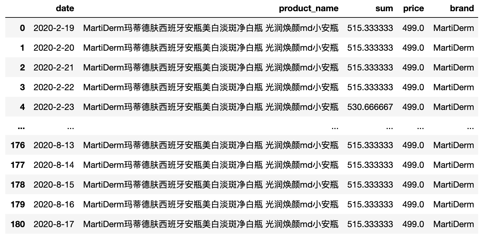

## Content

### the price sales data in price_sale_data.py
pls see details in it.

#### 20200916 bundle analysis
#### update 
具体用法可详见bundle analysis.py,目前单品识别以及单品的规格仍需手动获取

注：sum为单品在套装中的毫升数*单品每毫升价格的和
price为bundle原本的价格